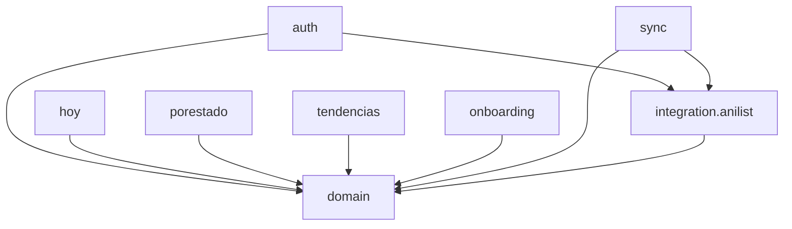
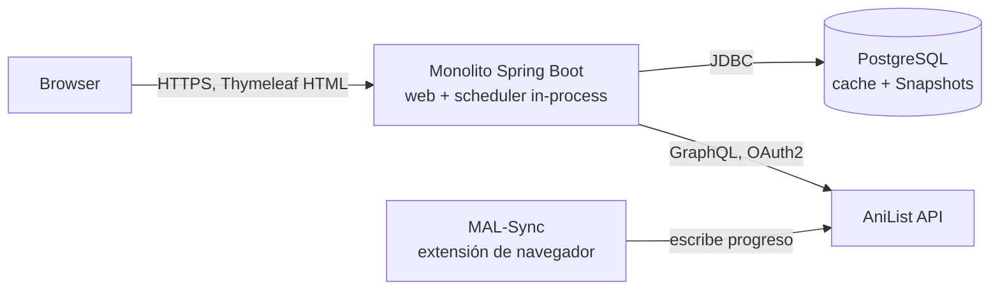
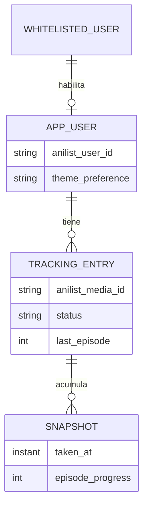

# Architecture Spine — AnimeTracker

## Design Paradigm

Monolito en capas (Controller → Service → Repository), organizado por feature-package (`auth`, `hoy`, `porestado`, `tendencias`, `onboarding`, `sync`), sobre un `domain` compartido. Toda comunicación con AniList pasa por `integration.anilist`, una capa anti-corrupción que aísla el resto del sistema del shape de las respuestas GraphQL: ningún controller o Thymeleaf template la invoca directo (ver AD-9).

## Invariants & Rules

### AD-1 — Layered + anti-corruption layer para AniList

- **Binds:** all
- **Prevents:** lógica de negocio o de vista acoplada al shape de las respuestas GraphQL de AniList; controllers accediendo repositorios de otra feature.
- **Rule:** cada feature-package expone solo Controller (Thymeleaf) → Service → Repository dentro de sí misma; cualquier dato de AniList entra únicamente vía `integration.anilist`.

### AD-2 — Single-writer sobre datos derivados de AniList

- **Binds:** FR-4, FR-6, FR-7, FR-8, FR-9
- **Prevents:** huecos de Snapshot por escrituras paralelas no coordinadas (rompe SM-3); dos rutas de escritura (login-sync vs job-sync) divergiendo en comportamiento; conteos por estado (FR-4) desincronizados de AniList porque nadie da de baja un `TrackingEntry` que el usuario ya sacó de su lista; otro feature-package escribiendo estas tablas porque sus repositorios eran alcanzables desde `domain`.
- **Rule:** los repositorios JPA de `TrackingEntry` y `Snapshot` viven dentro del package `sync` (no en `domain`), con visibilidad de package — ningún otro package puede inyectarlos. Otros features leen exclusivamente a través de `SyncedDataQueryService`, publicado por `sync` como interfaz de solo lectura. Cada corrida de sync (job o login) hace una reconciliación completa por usuario: upsert de las entradas presentes en la respuesta de AniList + baja lógica de cualquier `TrackingEntry` que ya no aparezca en ella.

### AD-3 — AniList es la única fuente de verdad; la DB propia nunca es autoritativa

- **Binds:** all
- **Prevents:** que la DB local se trate como catálogo/progreso canónico, o que AnimeTracker escriba hacia AniList (rompería PRD §5).
- **Rule:** la DB propia es cache de lectura + bitácora de Snapshots. Ninguna query GraphQL de tipo mutation existe en el codebase.

### AD-4 — Sesión y token server-side

- **Binds:** FR-1, FR-2, FR-9
- **Prevents:** exposición del token OAuth de AniList al cliente (template/JS); tratar la expiración/revocación del token (AniList: ~1 año, sin refresh token) como error genérico en vez de degradación.
- **Rule:** Spring Security + OAuth2 client; el access token vive server-side atado a la sesión, nunca en cookie de cliente ni en HTML. Un token inválido/expirado dispara el camino de degradación de FR-9, no una excepción sin manejar.

### AD-5 — Whitelist gate antes de sesión [ADOPTED]

- **Binds:** FR-2
- **Prevents:** crear sesión (o fila de `AppUser`) para un usuario no habilitado; mezclar el chequeo de whitelist con lógica de negocio de otra feature; dos componentes creando la misma fila de `AppUser` en una carrera de primer login.
- **Rule:** inmediatamente tras el callback OAuth, se consulta `WhitelistedUser` por el id de AniList (sin necesidad de `AppUser` todavía); si no está, se redirige a Acceso Denegado sin crear sesión ni fila. Si está, `auth` es el único owner de `findOrCreate(AppUser)` — se crea/recupera ahí, antes de abrir la sesión. `sync` nunca crea un `AppUser`, solo lee/actualiza uno ya existente. Gestión de la whitelist es manual (DB directa) en V1, sin UI admin.

### AD-6 — Sync job in-process, con concurrencia acotada y compartida

- **Binds:** FR-6, FR-9
- **Prevents:** exceder el rate limit de AniList (nominal 90 req/min, con burst limiter y 429 al superarlo — históricamente degradado a 30 req/min en ventanas de incidente, verificado en docs.anilist.co); que la falla de un usuario aborte la corrida completa; que un login-sync concurrente con una corrida del job sume llamadas por fuera del límite porque el limitador vivía solo dentro del job.
- **Rule:** un único `@Scheduled` corre en el mismo proceso JVM que el web app (sin worker service separado); intervalo default 45 min, configurable. El límite de concurrencia (semáforo/pool acotado, default 3, configurable) vive dentro de `integration.anilist` — envuelve toda llamada a AniList sin importar quién la origina (job o login), así ambos caminos comparten el mismo cupo automáticamente. Cada usuario se procesa en su propio try/catch — una falla no bloquea al resto.

### AD-7 — Login-sync reutiliza el código del job, de forma síncrona

- **Binds:** FR-7
- **Prevents:** que login-sync y job-sync diverjan en comportamiento por mantenerse como dos implementaciones separadas; que el primer render post-login muestre un Snapshot viejo en vez de la consulta fresca que exige FR-7.
- **Rule:** el login dispara el mismo método single-user de `SyncService` que usa el job periódico — no existe un segundo codepath de sincronización. Esa llamada es síncrona/bloqueante antes del primer render post-login (una sola query a AniList, no un batch — costo aceptable). El patrón de Skeleton de `EXPERIENCE.md` aplica a otras cargas (ej. toggle semana/mes de Tendencias), no al primer render post-login.

### AD-8 — Tendencias calculadas on-read desde Snapshots por (usuario, anime)

- **Binds:** FR-5
- **Prevents:** un agregado semanal/mensual persistido que puede desincronizarse de los Snapshots crudos; mostrar cero donde falta un Snapshot; dos lecturas incompatibles de qué representa una fila de `Snapshot` (por-usuario agregado vs por-anime) llevando a números de tendencia distintos según quién la implemente.
- **Rule:** cada corrida de sync persiste un `Snapshot` por (usuario, anime) — misma cardinalidad que `TrackingEntry` — nunca un agregado único por usuario. El valor de un período se calcula sumando, entre los animes del usuario, la diferencia de episodio entre Snapshots consecutivos por anime, en tiempo de consulta; no se persiste un agregado separado. Un período sin ningún Snapshot se devuelve como dato faltante explícito, nunca como cero.

### AD-9 — Dirección de dependencias

- **Binds:** all, NFR §8 (el Dashboard nunca dispara una consulta en vivo a AniList por carga de página)
- **Prevents:** ciclos entre features; que una vista de solo-lectura (Hoy, Por Estado, Tendencias, Onboarding) dispare una llamada en vivo a AniList en vez de leer del cache local — que es exactamente el NFR que la app no puede romper; `domain` importando DTOs de AniList y filtrando el aislamiento que busca AD-1.
- **Rule:** solo `auth` y `sync` dependen de `integration.anilist` (son los únicos dos flujos que hablan con AniList: OAuth y sincronización). `hoy`, `porestado`, `tendencias` y `onboarding` dependen únicamente de `domain`, leyendo vía `SyncedDataQueryService` (AD-2) — nunca de `integration.anilist` directo. `integration.anilist` depende de `domain` (mapea sus DTOs a entidades de dominio), nunca al revés. Ningún Controller/Thymeleaf template llama `integration.anilist` directo, saltándose su propio Service. Enforced por un test ArchUnit en el build (convención, no bloqueante para V1).



### AD-10 — Despliegue single-instance

- **Binds:** FR-6, NFR §8 (escala)
- **Prevents:** split prematuro en servicios web/worker separados a una escala de 100–1000 usuarios.
- **Rule:** un contenedor Docker con el monolito completo (web + scheduler in-process) + una instancia de PostgreSQL separada. Proveedor concreto: Deferred.

## Consistency Conventions

| Concern | Convention |
| --- | --- |
| Naming (entidades, estados) | `TrackingStatus` mapea 1:1 a `MediaListStatus` de AniList (CURRENT/PLANNING/COMPLETED/DROPPED/REPEATING) — nunca un enum en español inventado en el dominio; la localización vive solo en las templates Thymeleaf. |
| Data & formats (ids, fechas) | Timestamps siempre `Instant` UTC en DB. Cada entidad local mantiene su propia PK (auto-increment/UUID) más una columna indexada separada para el id remoto de AniList (media id / AniList user id) — nunca conflar ambos ids. |
| State & cross-cutting (mutación, errores, config, auth) | Mutación de datos derivados de AniList solo vía `SyncService` (AD-2). Fallas de sync se loggean y degradan (AD-4/FR-9), nunca rompen el render de página. Preferencia de tema persistida server-side como columna del usuario (no `localStorage`), para que sobreviva entre dispositivos. Config/secrets vía `application.yml` + variables de entorno (client id/secret AniList, credenciales DB) — nunca committeados. |

## Stack

| Name | Version |
| --- | --- |
| Java | 25 (LTS) |
| Spring Boot | 4.1.x (Spring Framework 7, Jakarta EE 11) |
| Thymeleaf | 3.1.x (server-rendered, sin SPA) |
| htmx | 2.x — fragment swaps para interacciones puntuales (ej. toggle semana/mes de Tendencias) sin JS a mano ni SPA |
| Tailwind CSS | 4.3.x |
| Spring Data JPA + Flyway | migraciones versionadas del esquema propio |
| PostgreSQL | 18.x |
| AniList API | GraphQL v2, OAuth2 authorization-code, rate limit nominal 90 req/min (degradado a 30 req/min en ventanas de incidente — cap de concurrencia conservador por AD-6), token ~1 año sin refresh |
| Cliente AniList | Spring `RestClient` + Jackson DTOs hand-mapped (sin librería de GraphQL client/codegen) |

## Structural Seed





Un `Snapshot` por (`TrackingEntry`, corrida de sync) — no un agregado único por usuario (ver AD-8).

```text
src/main/java/.../animetracker/
  domain/            # TrackingStatus, entidades compartidas (AppUser, TrackingEntry, Snapshot) — sin repositorios de TrackingEntry/Snapshot aquí
  integration/anilist/  # cliente GraphQL (con limitador de concurrencia compartido), DTOs, mapeo — única puerta de entrada a AniList
  auth/              # OAuth callback, whitelist gate, findOrCreate(AppUser), sesión
  sync/              # SyncService (single-writer), job @Scheduled, repositorios JPA package-private de TrackingEntry/Snapshot, SyncedDataQueryService (lectura para el resto)
  hoy/                # Dashboard "Hoy / Seguí Viendo"
  porestado/          # Vistas por Estado
  tendencias/         # Trends (cálculo on-read)
  onboarding/         # Setup de MAL-Sync
  config/             # Spring Security, scheduling, application config
src/main/resources/
  templates/         # Thymeleaf por feature
  static/            # Tailwind build
```

## Deferred

- UI de administración de Whitelist (OQ-1) — gestión manual alcanza para el volumen de V1; revisar si el ritmo de invitaciones lo justifica.
- Proveedor concreto de hosting (VPS propio vs PaaS gestionado) — AD-10 fija la forma (single-instance Docker + Postgres separado), no el proveedor.
- Escalado multi-instancia / locking distribuido del sync job — innecesario a la escala del PRD (~100–1000 usuarios); revisar si eso cambia.
- Pre-agregación de Tendencias para performance — prematuro mientras el cálculo on-read (AD-8) sea suficientemente rápido al volumen esperado.
- Política de purga/agregación de Snapshots (OQ-3) — retención indefinida adoptada para V1; revisar si el conteo de filas se vuelve un problema de storage/performance.
- Target numérico de SM-2 (frecuencia de retorno al Dashboard) — métrica de producto, no arquitectura.
- Operación: backup/restore de PostgreSQL y estrategia de logging/monitoring — depende del proveedor de hosting elegido (AD-10), no se fija a nivel arquitectura para V1 dado el perfil de riesgo de un proyecto personal/invitado.
